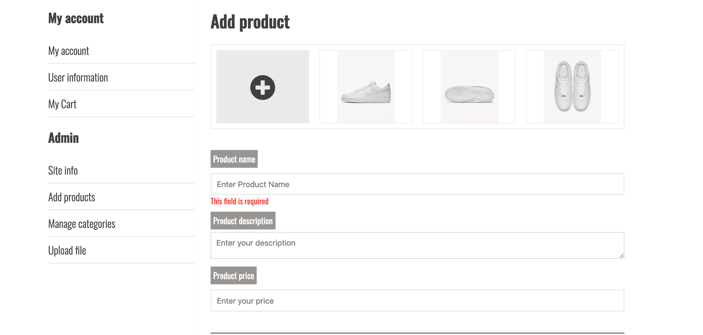
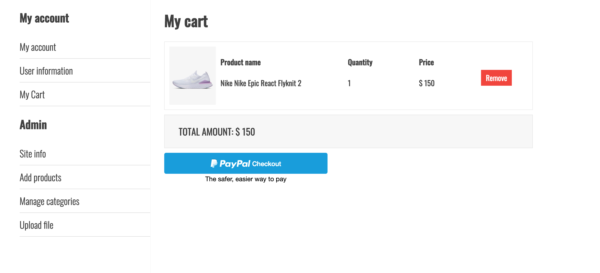
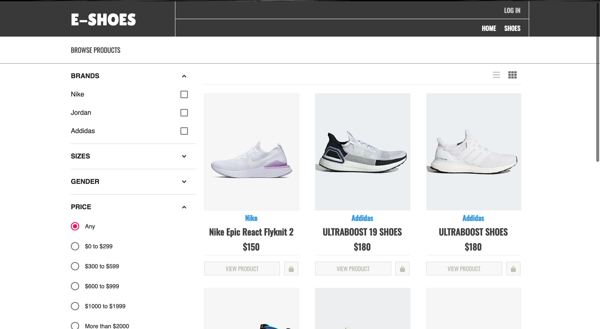

# E-Shoes


## Description

A shopping cart application build with MERN stack with admin section to manage products and checkout section using Paypal's API

View the <a href = "https://e-shoes.herokuapp.com/">site</a>

## Technologies & Tools

* React

* Node.js

* HTML

* CSS 

* MongoDb

* Material-ui, etc...

## Installation and Usage

### Requirements:

* Node.js installed

### Inside the app:

- Landing Page


- Admin Section (to upload products and customize the information of the store):



- Checkout Section (paypal API):



- Shopping Section (with filter):



### Steps:
1. Clone repo on your local machine:
```
$ git clone https://github.com/KhangNg92/e-shoes
```
2. Install dependencies on server:
```
$ cd e-shoes/server
$ npm install
```
3. Install dependencies on server:
```
$ cd e-shoes/client
$ npm install
```
4. Start server: <br/>
```
$ cd e-shoes/server
$ node server.js **or** nodemon server.js (if nodemon installed)
```
5. Start client:<br/>
```
$ cd e-shoes/client
$ npm start
```
6. App now running on localhost:3000
